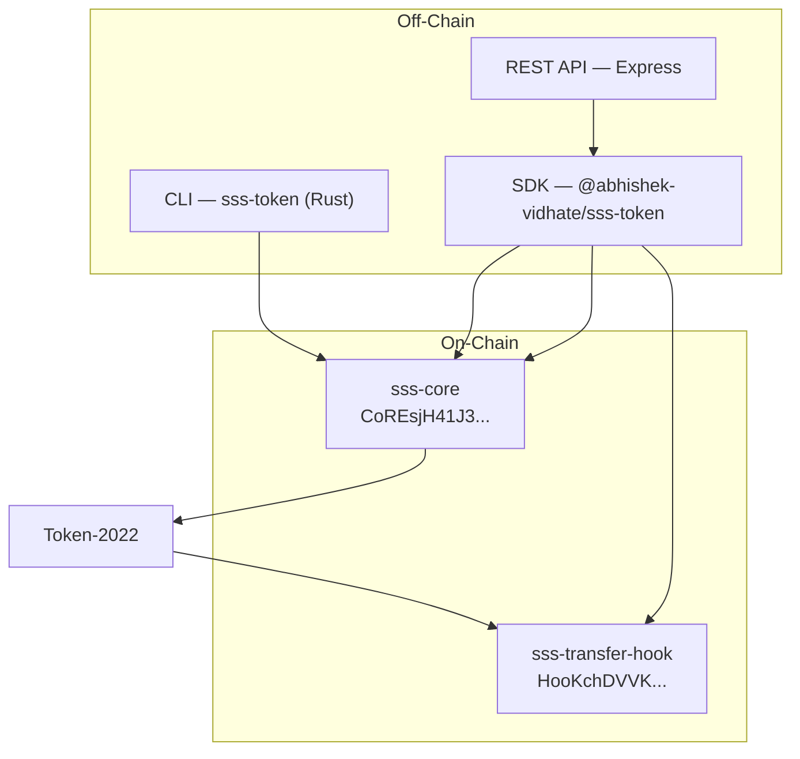

# Solana Stablecoin Standard (SSS)

A production-grade framework for issuing and managing stablecoins on Solana using Token-2022. One configurable on-chain program, four compliance presets, full SDK, CLI, and REST API.



## Presets

| Preset | Use Case | Extensions | Blacklist | Fees |
|---|---|---|:---:|:---:|
| **SSS-1** | DAO / utility tokens | MetadataPointer, PermanentDelegate | — | — |
| **SSS-2** | Regulated fiat (USDC-class) | + TransferHook, DefaultAccountState(Frozen) | Yes | — |
| **SSS-3** | Confidential / B2B | + ConfidentialTransferMint | — | — |
| **SSS-4** | Monetized (PYUSD-class) | SSS-2 + TransferFeeConfig | Yes | Yes |

All presets share the same on-chain program. The SDK configures different Token-2022 extensions at mint creation time.

## Quick Start

### 1. Build

```bash
anchor build
```

### 2. Test

```bash
anchor test
```

### 3. Deploy

```bash
anchor deploy
```

## SDK Usage

```bash
npm install @abhishek-vidhate/sss-token
```

```typescript
import { SolanaStablecoin, Preset } from "@abhishek-vidhate/sss-token";
import { BN } from "bn.js";

// Create a regulated stablecoin
const { stablecoin, mintKeypair } = await SolanaStablecoin.create(
  connection, wallet, {
    preset: Preset.SSS_2,
    name: "Regulated USD",
    symbol: "rUSD",
    uri: "https://example.com/metadata.json",
    decimals: 6,
  }
);

// Mint tokens
await stablecoin.mintTokens({
  minter: wallet.publicKey,
  recipient: userKey,
  amount: new BN(1_000_000_000),
});

// KYC approve (thaw account for SSS-2/4)
await stablecoin.thawAccount(freezerKey, userAta);

// Blacklist a sanctioned address
await stablecoin.compliance.blacklistAdd(
  blacklisterKey, sanctionedAddress, "OFAC-2026-001"
);
```

## CLI Usage

The CLI is a Rust binary (`sss-token`) built with clap. Install globally so you can run `sss-token` from any directory:

```bash
# Install (adds sss-token to ~/.cargo/bin; ensure it's in your PATH)
cargo install --path cli

# Then use like any CLI
sss-token --help
```

For development without installing:

```bash
cargo build -p sss-cli
./target/debug/sss-token --help

# Initialize (generates mint keypair; omit --mint to create new)
sss-token init --preset 2 --name "Regulated USD" --symbol "rUSD" --decimals 6
export SSS_MINT=<mint_address>

# Interactive TUI (monitoring + operations)
sss-token tui --mint $SSS_MINT   # Tab: Operations (mint/burn/freeze/thaw/pause/unpause/seize), Compliance (blacklist, roles)

# Operate (CLI)
sss-token mint --mint $SSS_MINT --to <RECIPIENT> --amount 1000000000
sss-token freeze --mint $SSS_MINT --account <TOKEN_ACCOUNT>
sss-token thaw --mint $SSS_MINT --account <TOKEN_ACCOUNT>
sss-token blacklist add --mint $SSS_MINT --address <WALLET> --reason "COMPLIANCE-001"
sss-token holders --mint $SSS_MINT
sss-token audit-log --mint $SSS_MINT
sss-token status --mint $SSS_MINT
```

## Backend API

```bash
# Start with Docker
export API_KEY="your-secure-key"
docker-compose up -d

# Mint via API
curl -X POST http://localhost:3000/operations/mint \
  -H "Content-Type: application/json" \
  -H "X-API-KEY: $API_KEY" \
  -d '{"mint": "<MINT>", "recipient": "<WALLET>", "amount": "1000000000"}'
```

## Architecture

- **2 programs:** `sss-core` (lifecycle, RBAC) + `sss-transfer-hook` (blacklist compliance)
- **Zero-copy config:** `StablecoinConfig` uses `AccountLoader` for efficient CU usage
- **7 roles:** Admin, Minter, Freezer, Pauser, Burner, Blacklister, Seizer
- **Two-step authority transfer:** Propose then accept to prevent lockout
- **Token-2022 native:** MetadataPointer, PermanentDelegate, TransferHook, DefaultAccountState, ConfidentialTransferMint, TransferFeeConfig
- **Pyth oracle:** Recommended for collateralized preset extensions; SDK `oracle` module with `PRICE_FEED_REGISTRY`, staleness checks. See [ARCHITECTURE.md#oracle-fields--pyth-integration](docs/ARCHITECTURE.md#oracle-fields--pyth-integration).

**Differentiators:** Zero-copy config, SSS-4 (transfer fees), two-step authority, sender blacklist fix, Docker, Trident fuzz. See [ARCHITECTURE.md#differentiators](docs/ARCHITECTURE.md#differentiators).

## Program IDs

| Program | Address |
|---|---|
| sss-core | `CoREsjH41J3KezywbudJC4gHqCE1QhNWaXRbC1QjA9ei` |
| sss-transfer-hook | `HooKchDVVKm7GkAX4w75bbaQUbMcDUnYXSzqLZCWKCDH` |

## Project Structure

```
programs/
  sss-core/          # Core stablecoin program (Anchor)
  sss-transfer-hook/ # Transfer hook compliance program (Anchor)
sdk/                 # TypeScript SDK (@abhishek-vidhate/sss-token)
cli/                 # Rust CLI (sss-token, clap) — includes interactive TUI
backend/             # Express REST API
tests/               # Integration tests (ts-mocha)
trident-tests/       # Trident fuzz + proptest
docs/                # Documentation
example/
  frontend/          # Next.js web UI (optional demo; uses SDK + backend API)
```

## Documentation

| Document | Description |
|---|---|
| [Architecture](docs/ARCHITECTURE.md) | System design, account structures, PDA derivation, CPI flows |
| [SSS-1](docs/SSS-1.md) | Minimal utility preset specification |
| [SSS-2](docs/SSS-2.md) | Regulated compliant preset specification |
| [SSS-3](docs/SSS-3.md) | Confidential preset (ZK transfer amounts) |
| [SSS-4](docs/SSS-4.md) | Monetized preset (transfer fees, PYUSD-style) |
| [SDK Reference](docs/SDK.md) | TypeScript SDK API, types, PDA helpers, error codes |
| [Operations Runbook](docs/OPERATIONS.md) | Operator procedures for deployment and daily operations |
| [Compliance](docs/COMPLIANCE.md) | Regulatory architecture (GENIUS Act, MiCA) |
| [API Reference](docs/API.md) | Backend REST endpoints, authentication, Docker setup |

## Tech Stack

| Component | Technology |
|---|---|
| Programs | Rust, Anchor 0.31.1, Token-2022 |
| SDK | TypeScript, @coral-xyz/anchor, @solana/spl-token |
| CLI | Rust, clap, solana-client, spl-token-2022 |
| Backend | Express, Zod, Winston, Helmet |
| Tests | ts-mocha, Chai; Trident + proptest |
| Deployment | Docker, docker-compose |

## License

See [LICENSE](LICENSE) for details.
