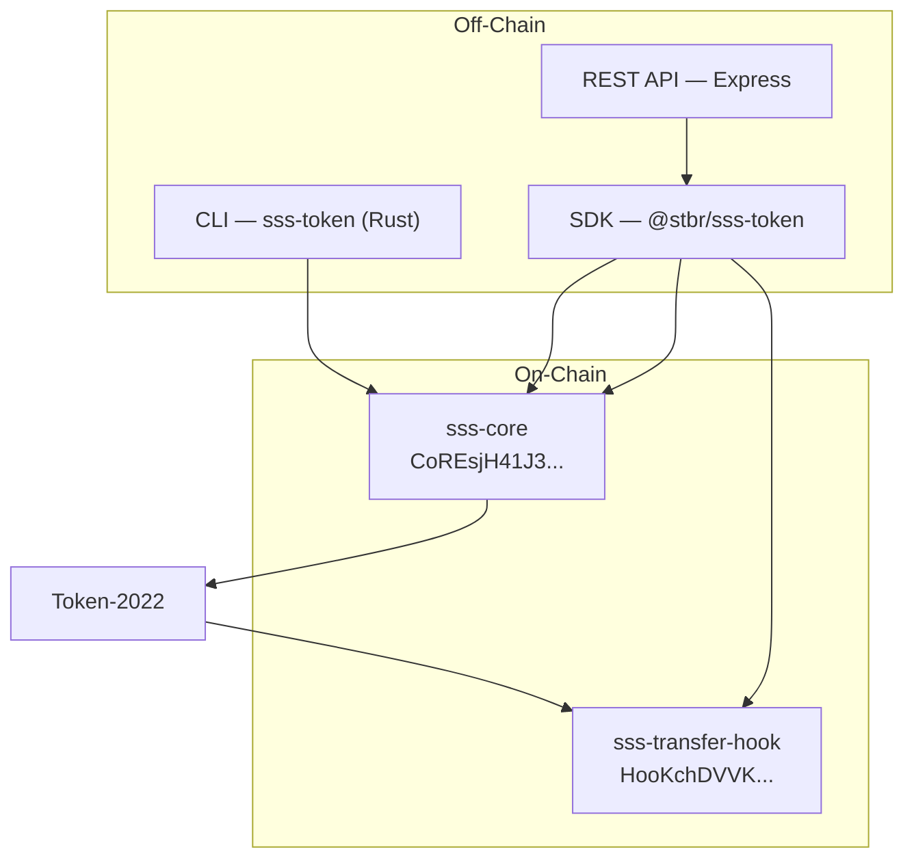

# Solana Stablecoin Standard (SSS)

A production-grade framework for issuing and managing stablecoins on Solana using Token-2022. One configurable on-chain program, four compliance presets, full SDK, CLI, and REST API.



## Presets

| Preset | Use Case | Extensions | Blacklist | Fees |
|---|---|---|:---:|:---:|
| **SSS-1** | DAO / utility tokens | MetadataPointer, PermanentDelegate | — | — |
| **SSS-2** | Regulated fiat (USDC-class) | + TransferHook, DefaultAccountState(Frozen) | Yes | — |
| **SSS-3** | Confidential / B2B | + ConfidentialTransferMint | — | — |
| **SSS-4** | Monetized (PYUSD-class) | SSS-2 + TransferFeeConfig | Yes | Yes |

All presets share the same on-chain program. The SDK configures different Token-2022 extensions at mint creation time.

## Quick Start

### 1. Build

```bash
anchor build
```

### 2. Test

```bash
anchor test
```

### 3. Deploy

```bash
anchor deploy
```

## SDK Usage

```bash
npm install @stbr/sss-token
```

```typescript
import { SolanaStablecoin, Preset } from "@stbr/sss-token";
import { BN } from "bn.js";

// Create a regulated stablecoin
const { stablecoin, mintKeypair } = await SolanaStablecoin.create(
  connection, wallet, {
    preset: Preset.SSS_2,
    name: "Regulated USD",
    symbol: "rUSD",
    uri: "https://example.com/metadata.json",
    decimals: 6,
  }
);

// Mint tokens
await stablecoin.mintTokens({
  minter: wallet.publicKey,
  recipient: userKey,
  amount: new BN(1_000_000_000),
});

// KYC approve (thaw account for SSS-2/4)
await stablecoin.thawAccount(freezerKey, userAta);

// Blacklist a sanctioned address
await stablecoin.compliance.blacklistAdd(
  blacklisterKey, sanctionedAddress, "OFAC-2026-001"
);
```

## CLI Usage

The CLI is a Rust binary (`sss-token`) built with clap. Install globally so you can run `sss-token` from any directory:

```bash
# Install (adds sss-token to ~/.cargo/bin; ensure it's in your PATH)
cargo install --path cli --locked

# Then use like any CLI
sss-token --help
```

For development without installing:

```bash
cargo build -p sss-cli
./target/debug/sss-token --help

# Initialize (generates mint keypair; omit --mint to create new)
sss-token init --preset 2 --name "Regulated USD" --symbol "rUSD" --decimals 6
export SSS_MINT=<mint_address>

# Interactive TUI (monitoring + operations)
sss-token tui --mint $SSS_MINT   # Tab: Operations (mint/burn/freeze/thaw/pause/unpause/seize), Compliance (blacklist, roles)

# Try out the TUI with the pre-seeded Aves USD (SSS-4) token on Devnet:
# sss-token tui --mint AGzqpW3Si8RK3myeNyG6NRVyLFpUZHJe7WMZF4oRNKPR

# Operate (CLI)
sss-token mint --mint $SSS_MINT --to <RECIPIENT> --amount 1000000000
sss-token freeze --mint $SSS_MINT --account <TOKEN_ACCOUNT>
sss-token thaw --mint $SSS_MINT --account <TOKEN_ACCOUNT>
sss-token blacklist add --mint $SSS_MINT --address <WALLET> --reason "COMPLIANCE-001"
sss-token holders --mint $SSS_MINT
sss-token audit-log --mint $SSS_MINT
sss-token status --mint $SSS_MINT
```

## Backend API

```bash
# Start with Docker
export SOLANA_RPC_URL="https://api.devnet.solana.com"
docker-compose up -d

# Mint via API
curl -X POST http://localhost:3000/operations/mint \
  -H "Content-Type: application/json" \
  -d '{"mint": "<MINT>", "recipient": "<WALLET>", "amount": "1000000000"}'
```

## Architecture & Compute Unit (CU) Performance

- **2 programs:** `sss-core` (lifecycle, RBAC) + `sss-transfer-hook` (blacklist compliance)
- **Zero-copy config:** `StablecoinConfig` uses `AccountLoader` for highly optimized CUs:
  - `initialize`: **~21,831 CU**
  - `mint_tokens`: **~13,556 CU**
  - `burn_tokens`: **~11,121 CU**
  - `update_transfer_fee`: **~12,888 CU**

## Major Design & Architecture Choices

### 1. Zero-Copy Configuration
The `sss-core` program utilizes `AccountLoader` for the `StablecoinConfig` account. This **zero-copy** approach allows the program to read configuration data directly from the account's input buffer without expensive heap allocation or Borsh deserialization. This is critical for keeping Compute Unit (CU) costs stable as the configuration grows.

### 2. Hierarchical Role-Based Access Control (RBAC)
Instead of a single "Owner" or "Upgrade Authority," SSS implements a robust RBAC system with **7 distinct roles**: Admin, Minter, Freezer, Pauser, Burner, Blacklister, and Seizer. This allows for strict separation of duties (e.g., a "Minter" cannot also "Blacklist" addresses).

### 3. SSS-4 Monetization (PYUSD-Class)
SSS-4 introducing native transfer fees using Token-2022's `TransferFeeConfig`. This is a production-grade implementation of a monetized stablecoin, allowing issuers to capture revenue on every transaction while maintaining full on-chain transparency.

### 4. Two-Step Authority Transfer
To prevent accidental protocol lockouts, authority transfer requires a two-step "Propose then Accept" process. The treasury is never at risk of being transferred to an invalid or unreachable address.

## Verification & Testing

### 1. Automated Integration Tests
The project includes a comprehensive suite of **60+ integration tests** covering all presets, edge cases, and security boundaries.

```bash
# Run all Anchor integration tests
anchor test
```

### 2. Trident Fuzzing (Honest Assessment)
While the SSS architecture is designed for high-security environments, **Trident stateful fuzz testing was not implemented** due to a documented framework-level incompatibility with Token-2022 programs ([Trident Issue #385](https://github.com/ackee-blockchain/trident/issues/385)). 

The Trident SVM environment encounters an `IncorrectProgramId` error at `GetAccountDataSize` because the ATA program uses legacy instruction encoding for Token-2022 accounts. This makes fuzzing instructions that require Token-2022 ATAs unfeasible. 

For full technical details, see [TRIDENT_INTEGRATION_ANALYSIS.md](docs/TRIDENT_INTEGRATION_ANALYSIS.md).

### 3. Compute Unit (CU) Reporting
A custom test reporter is provided to capture real-world CU consumption and transaction signatures.

```bash
# Generate a detailed CU and transaction report
npm run test:report
```

## Program Deployments (Devnet)

| Program | Address | Solana Explorer |
|---|---|---|
| sss-core | `CoREsjH41J3KezywbudJC4gHqCE1QhNWaXRbC1QjA9ei` | [View Details](https://explorer.solana.com/address/CoREsjH41J3KezywbudJC4gHqCE1QhNWaXRbC1QjA9ei?cluster=devnet) |
| sss-transfer-hook | `HooKchDVVKm7GkAX4w75bbaQUbMcDUnYXSzqLZCWKCDH` | [View Details](https://explorer.solana.com/address/HooKchDVVKm7GkAX4w75bbaQUbMcDUnYXSzqLZCWKCDH?cluster=devnet) |

*JSON representations of full devnet lifecycle operations can be found in `deployments/`*

## Project Structure

```
programs/
  sss-core/          # Core stablecoin program (Anchor)
  sss-transfer-hook/ # Transfer hook compliance program (Anchor)
sdk/                 # TypeScript SDK (@stbr/sss-token)
cli/                 # Rust CLI (sss-token, clap) — includes interactive TUI
backend/             # Express REST API
tests/               # Integration tests (ts-mocha)
docs/                # Documentation
example/
  frontend/          # Next.js web UI (optional demo; uses SDK + backend API)
```

## Documentation

| Document | Description |
|---|---|
| [Architecture](docs/ARCHITECTURE.md) | System design, account structures, PDA derivation, CPI flows |
| [SSS-1](docs/SSS-1.md) | Minimal utility preset specification |
| [SSS-2](docs/SSS-2.md) | Regulated compliant preset specification |
| [SSS-3](docs/SSS-3.md) | Confidential preset (ZK transfer amounts) |
| [SSS-4](docs/SSS-4.md) | Monetized preset (transfer fees, PYUSD-style) |
| [SDK Reference](docs/SDK.md) | TypeScript SDK API, types, PDA helpers, error codes |
| [Operations Runbook](docs/OPERATIONS.md) | Operator procedures for deployment and daily operations |
| [Compliance](docs/COMPLIANCE.md) | Regulatory architecture (GENIUS Act, MiCA) |
| [API Reference](docs/API.md) | Backend REST endpoints, authentication, Docker setup |
| [Trident & Token-2022](docs/TRIDENT_INTEGRATION_ANALYSIS.md) | Honest assessment of Trident compatibility with Token-2022 |

## Tech Stack

| Component | Technology |
|---|---|
| Programs | Rust, Anchor 0.31.1, Token-2022 |
| SDK | TypeScript, @coral-xyz/anchor, @solana/spl-token |
| CLI | Rust, clap, solana-client, spl-token-2022 |
| Backend | Express, Zod, Winston, Helmet |
| Tests | ts-mocha, Chai |
| Deployment | Docker, docker-compose |

## License

See [LICENSE](LICENSE) for details.
