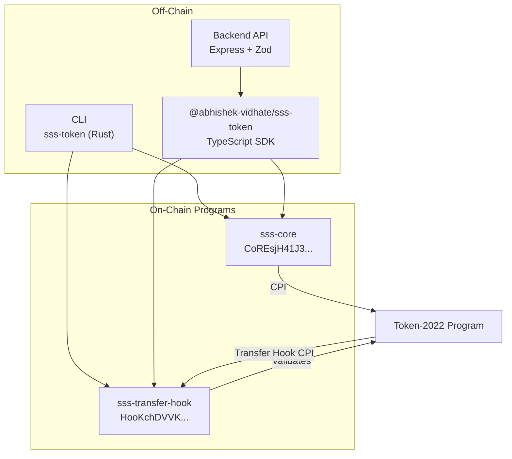
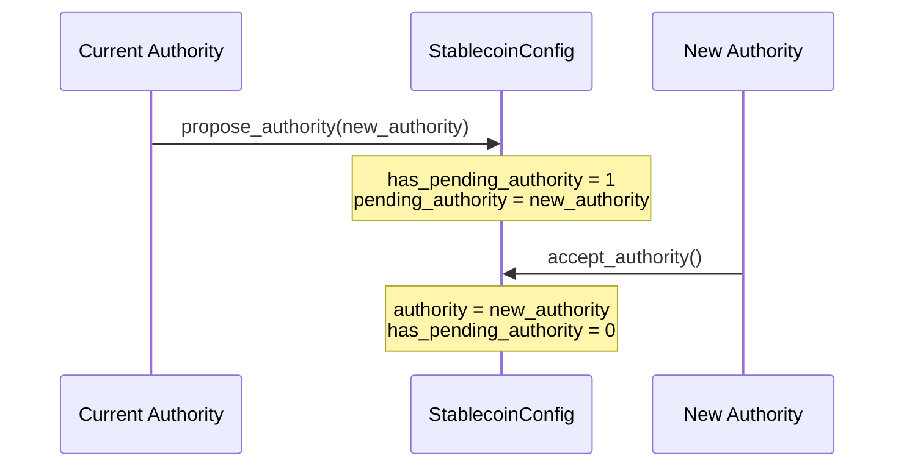
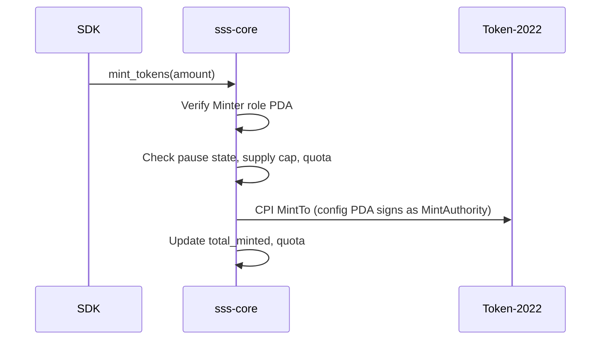
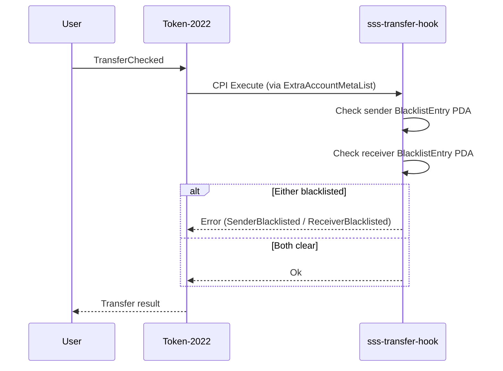
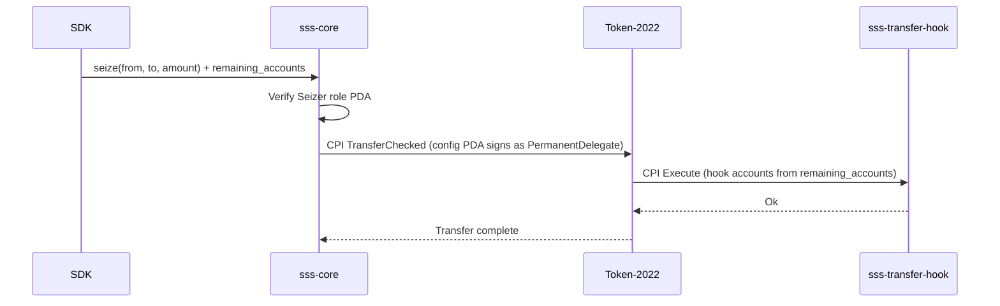

# Solana Stablecoin Standard (SSS) Architecture

This document describes the production architecture of the Solana Stablecoin Standard — a modular framework for issuing and managing stablecoins on Solana using Token-2022.

## System Overview

The SSS uses a **2-program on-chain architecture** with **SDK-level presets**. Rather than deploying separate programs per compliance tier, a single configurable `sss-core` program handles all token lifecycle operations, while `sss-transfer-hook` enforces transfer-time compliance. The SDK layer maps the four preset tiers (SSS-1 through SSS-4) to different combinations of Token-2022 extensions at mint creation.



## On-Chain Programs

### sss-core (`CoREsjH41J3KezywbudJC4gHqCE1QhNWaXRbC1QjA9ei`)

The core program manages the entire stablecoin lifecycle: initialization, minting, burning, freezing, pausing, seizing, RBAC, and authority transfer. It uses **zero-copy deserialization** for the config account and issues CPIs to Token-2022 for all token operations.

**Instructions:**

| Instruction | Role Required | Description |
|---|---|---|
| `initialize` | Authority (initial) | Create config, set preset, extensions, metadata |
| `mint_tokens` | Minter | Mint tokens to a recipient ATA |
| `burn_tokens` | Burner | Burn tokens from a token account |
| `freeze_account` | Freezer | Freeze a user's token account |
| `thaw_account` | Freezer | Thaw a frozen token account |
| `pause` | Pauser | Globally pause mint/burn operations |
| `unpause` | Pauser | Resume operations |
| `seize` | Seizer | Force-transfer via PermanentDelegate |
| `grant_role` | Admin | Grant a role to an address |
| `revoke_role` | Admin | Revoke a role from an address |
| `propose_authority` | Admin (current authority) | Propose a new authority (two-step) |
| `accept_authority` | Pending authority | Accept proposed authority transfer |
| `update_supply_cap` | Admin | Set or remove global supply cap |
| `update_minter` | Admin | Set or remove per-minter quota |
| `update_transfer_fee` | Admin | Change fee bps and max fee (SSS-4) |
| `withdraw_withheld` | Admin | Sweep collected transfer fees (SSS-4) |

### sss-transfer-hook (`HooKchDVVKm7GkAX4w75bbaQUbMcDUnYXSzqLZCWKCDH`)

The transfer hook program is invoked by Token-2022 on every `TransferChecked` call for mints configured with the `TransferHook` extension (SSS-2, SSS-4). It enforces blacklist-based compliance.

**Instructions:**

| Instruction | Description |
|---|---|
| `initialize_extra_account_metas` | Set up the ExtraAccountMetaList for the mint |
| `transfer_hook` | Validate sender/receiver against blacklist PDAs |
| `add_to_blacklist` | Add an address to the blacklist (Blacklister role) |
| `remove_from_blacklist` | Remove an address from the blacklist (Blacklister role) |
| `fallback` | Routes SPL transfer hook interface calls to `transfer_hook` |

## Account Structures

### StablecoinConfig (Zero-Copy)

The config account uses Anchor's `#[account(zero_copy(unsafe))]` for efficient deserialization without copying the full account into heap memory. This is critical for keeping CU costs low on reads.

```rust
#[account(zero_copy(unsafe))]
pub struct StablecoinConfig {
    pub authority: Pubkey,           // 32
    pub mint: Pubkey,                // 32
    pub preset: u8,                  // 1  (1-4)
    pub paused: u8,                  // 1  (0 or 1)
    pub has_supply_cap: u8,          // 1
    pub supply_cap: u64,             // 8
    pub total_minted: u64,           // 8
    pub total_burned: u64,           // 8
    pub bump: u8,                    // 1
    pub name: [u8; 32],             // 32
    pub symbol: [u8; 10],           // 10
    pub uri: [u8; 200],             // 200
    pub decimals: u8,                // 1
    pub enable_permanent_delegate: u8, // 1
    pub enable_transfer_hook: u8,    // 1
    pub default_account_frozen: u8,  // 1
    pub admin_count: u16,            // 2
    pub has_oracle_feed: u8,         // 1
    pub oracle_feed_id: [u8; 32],   // 32
    pub transfer_fee_basis_points: u16, // 2
    pub maximum_fee: u64,            // 8
    pub has_pending_authority: u8,   // 1
    pub pending_authority: Pubkey,   // 32
    pub _reserved: [u8; 31],        // 31 (future expansion)
}
```

Total account space: **8 (discriminator) + struct size**.

The `zero_copy(unsafe)` strategy uses `repr(packed)` which avoids padding between heterogeneous field types (`u8` next to `u64`). This is safe on Solana's BPF/SBF VM which supports unaligned memory access.

### RoleAccount

```rust
#[account]
pub struct RoleAccount {
    pub config: Pubkey,        // 32
    pub address: Pubkey,       // 32
    pub role: Role,            // 1
    pub granted_by: Pubkey,    // 32
    pub granted_at: i64,       // 8
    pub bump: u8,              // 1
    pub mint_quota: Option<u64>, // 1 + 8
    pub amount_minted: u64,    // 8
}
```

Account space: **131 bytes** (8 discriminator + 123 data).

### BlacklistEntry

```rust
#[account]
pub struct BlacklistEntry {
    pub mint: Pubkey,          // 32
    pub address: Pubkey,       // 32
    pub added_by: Pubkey,      // 32
    pub added_at: i64,         // 8
    pub reason: String,        // 4 + up to 128
    pub bump: u8,              // 1
}
```

Account space: **245 bytes**.

## PDA Seeds and Derivation

All PDAs are deterministically derived. The SDK provides helper functions for each.

| PDA | Program | Seeds | Purpose |
|---|---|---|---|
| StablecoinConfig | sss-core | `["sss-config", mint]` | Global config for a stablecoin |
| RoleAccount | sss-core | `["sss-role", config, address, role_u8]` | Per-user role assignment |
| BlacklistEntry | sss-transfer-hook | `["blacklist", mint, address]` | Per-address blacklist entry |
| ExtraAccountMetas | sss-transfer-hook | `["extra-account-metas", mint]` | Transfer hook account resolution |

## Token-2022 Extension Matrix

Each preset configures different Token-2022 extensions at mint creation time. The on-chain program is identical — the SDK preset functions control which extensions are initialized.

| Extension | SSS-1 | SSS-2 | SSS-3 | SSS-4 |
|---|:---:|:---:|:---:|:---:|
| `MetadataPointer` | Yes | Yes | Yes | Yes |
| `PermanentDelegate` | Yes | Yes | Yes | Yes |
| `FreezeAuthority` | Yes | Yes | Yes | Yes |
| `TransferHook` | — | Yes | — | Yes |
| `DefaultAccountState(Frozen)` | — | Yes | — | Yes |
| `ConfidentialTransferMint` | — | — | Yes | — |
| `TransferFeeConfig` | — | — | — | Yes |

All presets set `MintAuthority` and `FreezeAuthority` to the config PDA after initialization, delegating full control to the sss-core program.

## Role-Based Access Control (RBAC)

Seven roles govern all privileged operations. Each role is a PDA-backed `RoleAccount` tied to a specific config and wallet address.

| ID | Role | Capabilities |
|---|---|---|
| 0 | **Admin** | Grant/revoke roles, update supply cap, update minter quotas, propose authority transfer, update fees |
| 1 | **Minter** | Mint tokens (subject to optional per-minter quota) |
| 2 | **Freezer** | Freeze and thaw individual token accounts |
| 3 | **Pauser** | Globally pause and unpause mint/burn operations |
| 4 | **Burner** | Burn tokens from a token account |
| 5 | **Blacklister** | Add/remove addresses from the transfer hook blacklist |
| 6 | **Seizer** | Force-transfer tokens via PermanentDelegate |

The `admin_count` field on `StablecoinConfig` tracks active admins. The program prevents revoking the last admin to avoid bricking the protocol.

## Two-Step Authority Transfer

Authority transfer follows a propose/accept pattern to prevent accidental lockout:



## CPI Flow for Token-2022 Operations

### Mint Flow



### Transfer Hook Flow (SSS-2, SSS-4)



### Seize Flow (SSS-2, SSS-4)

The seize instruction uses the PermanentDelegate to force-transfer tokens. For mints with a TransferHook, the SDK appends the hook's `ExtraAccountMetaList` and hook program ID to `remaining_accounts` so the inner Token-2022 CPI succeeds.



## Compute Optimization Techniques

The following techniques are applied to minimize CU consumption:

### Data Layout & Serialization

| Technique | Implementation |
|-----------|----------------|
| **Zero-copy config** | `StablecoinConfig` uses `#[account(zero_copy(unsafe))]` and `AccountLoader` — no Borsh heap allocation on reads. |
| **repr(packed)** | Zero-copy struct avoids padding between heterogeneous fields (`u8` next to `u64`); safe on Solana BPF/SBF. |
| **Compact layouts** | Minimal integer sizes (u8 for booleans/flags), fixed arrays; no Vecs in hot paths. |
| **In-place writes** | `load_mut()` / `drop()` pattern — only mutated bytes written, no full re-serialize. |

### Accounts & Hot Paths

| Technique | Implementation |
|-----------|----------------|
| **Transfer hook lean** | `transfer_hook` uses `UncheckedAccount` only; `data_is_empty()` check, no deserialization. |
| **Minimal account set** | Only necessary accounts passed per instruction; no unused accounts. |
| **Blacklister verify** | PDA re-derivation + key match (no CPI to sss-core for role check). |

### Build & Tooling

| Technique | Implementation |
|-----------|----------------|
| **Release profile** | Workspace `[profile.release]`: `opt-level=3`, `lto="fat"`, `codegen-units=1`, `overflow-checks=true`. |
| **cu-profile** | Feature-gated `sol_log_compute_units()` in hot/admin instructions; compiles out by default. |

### Constraint Usage

- **Selective constraints** — Only enforce what is needed; audit performed; no redundant checks.
- **Seeds over constraints** — PDAs validated via seeds where possible; constraints only when account is not PDA-derived.

---

## CU Benchmark (from `npm run test:report`)

Measured on localnet with optimized release build:

| Instruction | Min CU | Max CU | Avg CU |
|-------------|--------|--------|--------|
| `initialize` | 17,254 | 30,974 | 21,831 |
| `mint_tokens` | 11,819 | 15,130 | 13,556 |
| `burn_tokens` | 11,121 | 11,121 | 11,121 |
| `seize` | 12,770 | 12,770 | 12,770 |
| `initialize_extra_account_metas` | 10,678 | 10,678 | 10,678 |
| `add_to_blacklist` | 18,378 | 18,378 | 18,378 |
| `remove_from_blacklist` | 13,653 | 13,653 | 13,653 |
| `update_transfer_fee` | 12,888 | 12,888 | 12,888 |

*Generate reports with `npm run test:report`; output in `reports/test-report-<timestamp>.md`.*

---

## Differentiators

Compared to reference implementations (PR#6, PR#19), this SSS implementation adds:

| Differentiator | Description |
|---|---|
| **Zero-copy config** | `StablecoinConfig` uses `AccountLoader` for significant CU reduction on reads; competitors use regular `Account`. |
| **SSS-4 (Transfer Fees)** | Full preset 4 support: `TransferFeeConfig`, `update_transfer_fee`, `withdraw_withheld` in program, SDK, and CLI. |
| **Two-step authority transfer** | `propose_authority` / `accept_authority` prevents accidental lockout; competitors use single-step. |
| **Sender blacklist fix** | Transfer hook derives sender PDA from **owner** in account data, not delegate; fixes delegate bypass (C-1). |
| **Docker** | `docker-compose` and `Dockerfile` for backend deployment; competitors lack containerized setup. |
| **Trident fuzz binary** | Real Trident 0.12 with on-chain-style transaction flows and supply invariant; competitors have proptest only. |

---

## Design Decisions

### Oracle Fields & Pyth Integration

The `StablecoinConfig` includes `has_oracle_feed` and `oracle_feed_id` fields for oracle-configured mints. **Pyth Network** is the recommended oracle for Solana stablecoin price feeds.

#### Why Pyth for Stablecoins on Solana

- **Pull oracle model** — Price updates are posted on-chain by Pyth; programs read `PriceUpdateV2` accounts. Suited for collateralized or oracle-gated mint flows.
- **High-frequency feeds** — Sub-second updates for major pairs (SOL/USD, ETH/USD, USDC/USD).
- **Rust & TypeScript SDKs** — `pyth-solana-receiver-sdk` (on-chain) and `@pythnetwork/pyth-solana-receiver` (off-chain) integrate with Anchor and the SSS SDK.
- **Best practices** — Use `getPriceNoOlderThan()` for staleness checks, validate account ownership, and guard against adversarial price selection.

#### SDK Usage

The SDK `oracle` module provides `PRICE_FEED_REGISTRY`, `getOracleFeedIdBytes()`, and `convertUsdToRawAmount()` for oracle-configured mints. See `sdk/src/oracle/index.ts` and `docs/SDK.md`.

#### Fiat-Backed vs Collateralized

Fiat-backed stablecoins (USDC, PYUSD, USDT) validate peg off-chain via reserve attestation. On-chain Pyth validation is intended for **collateralized preset extensions** (e.g. crypto-backed CDPs), not fiat-backed issuance.

## Off-Chain Stack

| Component | Technology | Purpose |
|---|---|---|
| **SDK** | TypeScript (`@abhishek-vidhate/sss-token`) | Instruction building, PDA derivation, preset creation, error translation |
| **CLI** | Rust (clap 4) | Native binary; uses sss-core and sss-transfer-hook IDLs directly (not the SDK) |
| **Backend** | Express + Zod + Winston | REST API with validation, rate limiting, API key auth; uses SDK |
| **Docker** | docker-compose | Containerized backend deployment |
