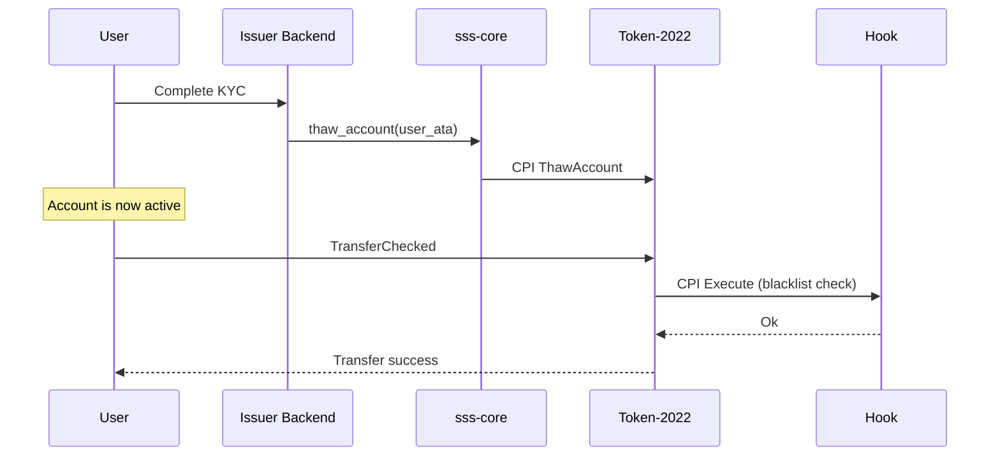
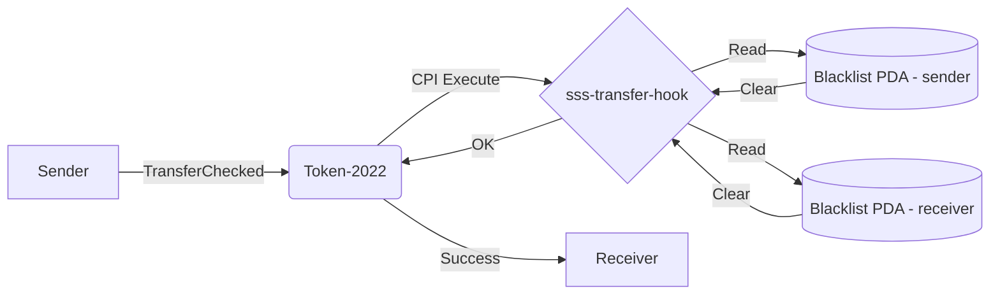

# SSS-2: Regulated Compliant Stablecoin

The SSS-2 preset is built to satisfy regulatory requirements for fiat-backed stablecoins interacting with legacy financial systems (e.g., GENIUS Act, MiCA). It operates on a "verify-by-default" model: accounts start frozen and every transfer is validated against a blacklist.

**Target Audience:** Fiat issuers (USDC/USDT class), regulated fintechs, institutional stablecoins.

## Token-2022 Extensions

| Extension | Configuration |
|---|---|
| `MetadataPointer` | Points to the mint itself |
| `PermanentDelegate` | Set to the config PDA (seizure capability) |
| `FreezeAuthority` | Set to the config PDA |
| `MintAuthority` | Set to the config PDA |
| `TransferHook` | Points to `sss-transfer-hook` (`HooKchDVVK...`) |
| `DefaultAccountState` | `Frozen` — new token accounts start frozen |

## KYC/AML Flow

SSS-2 enforces a compliance pipeline where users cannot transact until explicitly approved:



## Transfer Hook Architecture

Every transfer invokes the `sss-transfer-hook` program. The hook resolves `BlacklistEntry` PDAs for both sender and receiver. If either address has a blacklist entry, the transfer fails.



## The Seize Workaround

When executing a seizure (force-transfer via PermanentDelegate), the `TransferChecked` CPI does not automatically forward the `ExtraAccountMetaList` accounts to the hook. The SDK handles this transparently:

```typescript
// The SDK detects that the mint has a TransferHook and automatically appends
// the Hook Program ID and ExtraAccountMetaList to remaining_accounts.
await stablecoin.seize({
  seizer: wallet.publicKey,
  from: frozenAccountAta,
  to: treasuryAta,
  amount: new BN(1_000_000),
});
```

## Available Instructions

| Instruction | Available | Notes |
|---|:---:|---|
| `initialize` | Yes | Creates mint with full compliance extension set |
| `mint_tokens` | Yes | Minter role |
| `burn_tokens` | Yes | Burner role |
| `freeze_account` | Yes | Freezer role (KYC rejection) |
| `thaw_account` | Yes | Freezer role (KYC approval) |
| `pause` / `unpause` | Yes | Pauser role |
| `seize` | Yes | Seizer role, via PermanentDelegate + hook passthrough |
| `grant_role` / `revoke_role` | Yes | Admin role |
| `propose_authority` / `accept_authority` | Yes | Two-step authority transfer |
| `update_supply_cap` | Yes | Admin role |
| `update_minter` | Yes | Admin role |
| `update_transfer_fee` | No | SSS-4 only |
| `withdraw_withheld` | No | SSS-4 only |
| `blacklist add/remove` | Yes | Blacklister role (via sss-transfer-hook) |

## Applicable Roles

All seven roles are active in SSS-2:

| Role | Applicable | Purpose |
|---|:---:|---|
| Admin (0) | Yes | Manage roles, config |
| Minter (1) | Yes | Mint tokens |
| Freezer (2) | Yes | KYC thaw/freeze |
| Pauser (3) | Yes | Emergency pause |
| Burner (4) | Yes | Burn tokens |
| Blacklister (5) | Yes | Manage blacklist |
| Seizer (6) | Yes | Force-transfer via PermanentDelegate |

## SDK Usage

```typescript
import { SolanaStablecoin, Preset } from "@abhishek-vidhate/sss-token";

const { stablecoin, mintKeypair } = await SolanaStablecoin.create(
  connection,
  wallet,
  {
    preset: Preset.SSS_2,
    name: "Regulated USD",
    symbol: "rUSD",
    uri: "https://example.com/rusd.json",
    decimals: 6,
  }
);

// Grant compliance roles
await stablecoin.roles.grant(wallet.publicKey, freezerKey, Role.Freezer);
await stablecoin.roles.grant(wallet.publicKey, blacklisterKey, Role.Blacklister);

// KYC approve a user
await stablecoin.thawAccount(freezerKey, userAta);

// Blacklist a sanctioned address
await stablecoin.compliance.blacklistAdd(blacklisterKey, sanctionedAddress, "OFAC-2026-001");
```

## CLI Usage

```bash
sss-token init --preset 2 --name "Regulated USD" --symbol "rUSD" --decimals 6

# KYC operations
sss-token thaw --account <USER_ATA>
sss-token freeze --account <USER_ATA>

# Compliance operations
sss-token blacklist add --address <ADDRESS> --reason "OFAC-2026-001"
sss-token blacklist remove --address <ADDRESS>
sss-token blacklist check --address <ADDRESS>

# Emergency seizure
sss-token seize --from <SOURCE_ATA> --to <TREASURY_ATA> --amount 1000000
```
