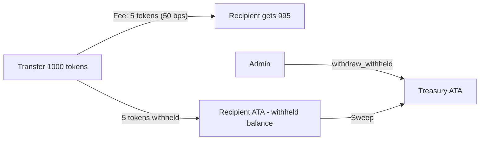

# SSS-4: Monetized Stablecoin (PYUSD Style)

The SSS-4 preset is the enterprise-ready stablecoin format with built-in revenue generation. It combines full SSS-2 compliance tooling with native transfer fees, replicating the on-chain structure used by PayPal's PYUSD.

**Target Audience:** Consumer-scale fintechs, Web2 companies entering Web3, yield-generating stablecoins, payment processors.

## Token-2022 Extensions

| Extension | Configuration |
|---|---|
| `MetadataPointer` | Points to the mint itself |
| `PermanentDelegate` | Set to the config PDA (seizure capability) |
| `FreezeAuthority` | Set to the config PDA |
| `MintAuthority` | Set to the config PDA |
| `TransferHook` | Points to `sss-transfer-hook` (blacklist enforcement) |
| `DefaultAccountState` | `Frozen` — new accounts start frozen (KYC required) |
| `TransferFeeConfig` | Configurable basis points + maximum fee, authorities set to config PDA |

## The Transfer Fee Mechanism

`TransferFeeConfig` is initialized with:

| Parameter | Description |
|---|---|
| `transfer_fee_basis_points` | Percentage taken per transfer (e.g., 50 bps = 0.5%) |
| `maximum_fee` | Hard cap on the fee per transfer |
| `transfer_fee_config_authority` | Config PDA — can change fee rate |
| `withdraw_withheld_authority` | Config PDA — can sweep collected fees |

### Zero-Friction Launch Strategy

Following the PYUSD playbook, SSS-4 mints are typically deployed with `transfer_fee_basis_points = 0`. This ensures zero-friction adoption during the growth phase while permanently embedding the capability to enable fees later. Because the `TransferFeeConfig` extension must be initialized at mint creation, deploying SSS-4 future-proofs the asset.

### Fee Collection

Fees are withheld in each recipient's token account. The admin calls `withdraw_withheld` to sweep fees from source accounts into a designated treasury account.



## Interactions with Compliance

SSS-4 inherits all KYC pipeline restrictions from SSS-2:

- New token accounts start frozen (DefaultAccountState)
- Transfers must clear the `sss-transfer-hook` blacklist validation
- Seizures bypass the transfer fee (the protocol does not tax itself during clawbacks)
- Seizures pass hook accounts via `remaining_accounts`

## Available Instructions

| Instruction | Available | Notes |
|---|:---:|---|
| `initialize` | Yes | Creates mint with full extension set including TransferFeeConfig |
| `mint_tokens` | Yes | Minter role |
| `burn_tokens` | Yes | Burner role |
| `freeze_account` | Yes | Freezer role |
| `thaw_account` | Yes | Freezer role |
| `pause` / `unpause` | Yes | Pauser role |
| `seize` | Yes | Seizer role |
| `grant_role` / `revoke_role` | Yes | Admin role |
| `propose_authority` / `accept_authority` | Yes | Two-step authority transfer |
| `update_supply_cap` | Yes | Admin role |
| `update_minter` | Yes | Admin role |
| `update_transfer_fee` | Yes | Admin role, SSS-4 only |
| `withdraw_withheld` | Yes | Admin role, SSS-4 only |
| `blacklist add/remove` | Yes | Blacklister role (via sss-transfer-hook) |

## Applicable Roles

All seven roles are active in SSS-4:

| Role | Applicable | Purpose |
|---|:---:|---|
| Admin (0) | Yes | Manage roles, config, fees |
| Minter (1) | Yes | Mint tokens |
| Freezer (2) | Yes | KYC thaw/freeze |
| Pauser (3) | Yes | Emergency pause |
| Burner (4) | Yes | Burn tokens |
| Blacklister (5) | Yes | Manage blacklist |
| Seizer (6) | Yes | Force-transfer via PermanentDelegate |

## SDK Usage

```typescript
import { SolanaStablecoin, Preset } from "@abhishek-vidhate/sss-token";
import { BN } from "@coral-xyz/anchor";

// Deploy with 0 bps (zero-friction launch)
const { stablecoin, mintKeypair } = await SolanaStablecoin.create(
  connection,
  wallet,
  {
    preset: Preset.SSS_4,
    name: "PayCoin",
    symbol: "PAY",
    uri: "https://example.com/pay.json",
    decimals: 6,
    transferFeeBasisPoints: 0,
    maximumFee: new BN(0),
  }
);

// Later: enable 50 bps fee with 1 USDC max
await stablecoin.fees.updateFee(wallet.publicKey, 50, new BN(1_000_000));

// Check current fee config
const feeConfig = await stablecoin.fees.getConfig();
console.log(`Fee: ${feeConfig.basisPoints} bps, max: ${feeConfig.maximumFee.toString()}`);

// Sweep collected fees to treasury
await stablecoin.fees.withdrawWithheld(wallet.publicKey, treasuryAta);
```

## CLI Usage

```bash
# Create SSS-4 with zero fees initially
sss-token init \
  --preset 4 \
  --name "PayCoin" \
  --symbol "PAY" \
  --decimals 6 \
  --fee-bps 0 \
  --max-fee 0

# Enable fees later
sss-token fees --update-bps 50 --update-max 1000000

# Check fee config
sss-token fees

# Withdraw collected fees
sss-token fees --withdraw-to <TREASURY_ATA>

# All SSS-2 compliance commands also apply
sss-token blacklist add --address <ADDRESS> --reason "COMPLIANCE-001"
sss-token seize --from <SOURCE_ATA> --to <TREASURY_ATA> --amount 1000000
```
